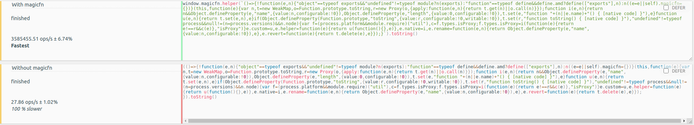

# magicfn - adds some magic to function


## Sometimes this would be very useful

### Features

- make any function as native function
- control stringified content of any function
- babel macros support for puppetter ...etc

### Standalone Usage

```js
import { native } from 'magicfn';
const fn = native(() => 1, 'hello');
console.log(fn); // function hello() { [native code] }
console.log(fn()); // 1
```

### with Macro + Puppeteer usage

### 132,794x faster stringify than normal function (incredible speed)


this is magicfn's whole source

- only stringified results are same with original, replaced with noop
- you can use this with [vercel/pkg](https://github.com/vercel/pkg) and [bytenode](https://github.com/OsamaAbbas/bytenode)
- function will never be parsed and send to browser directly (good for speed)

```js
import $$ from 'magicfn/macro';

page.eval(
  $$(arg => {
    const $el = document.querySelector('video');
    console.log($el, arg);
  })
);
```

#### After

```js
import { helper as _helper } from 'magicfn';

page.eval(
  _helper(
    "arg=>{const $el=document.querySelector('video');console.log($el,arg);}"
  ) // just compiled function as string
);
```

### Requires

- WeakMap
- Proxy (CANNOT be polyfilled)

### Documents

```ts
/**
 * Make any function as native function
 *
 * @param fn any function to mock as native
 * @param name new name, optional
 *
 * @example
 * const fn = () => 1;
 * native(fn, 'hello');
 * fn() === 1
 * "" + fn === 'function hello() { [native code] }'
 * fn.name === 'hello'
 *
 * fn.toString.toString.toString......toString()
 * === 'function toString() { [native code] }'
 *
 * (fn.toString === Function.prototype.toString) === true
 */
export declare function native<T extends Fn>(fn: T, name?: string): T;

/**
 * Rename a function
 * @param fn function to rename
 * @param name new name
 *
 * @example
 * rename(() => 1, 'one').name === 'one'
 */
export declare function rename<T extends Fn>(fn: T, name: string): T;

/**
 * Defines a custom string for a function
 * @param fn function to customize stringified result
 * @param str string
 *
 * @example
 * const fn = custom(() => 1, 'hello world');
 * fn() === 1
 * "" + fn === 'hello world'
 * fn.toString.toString() === 'function toString() { [native code] }'
 *
 * // this is applied for any other library or even developer tools
 * import serialize from "serialize-javascript"
 * serialize(fn) === 'hello world' // but this cannot evaled
 *
 * import puppeteer from "puppeteer"
 * const browser = await puppeteer.launch()
 * const page = await browser.newPage()
 *
 * await page.evaluate(
 *   custom(() => {}, `
 *     function hello() {
 *       alert('mocked function');
 *     }`
 *   )
 * );
 */
export declare function custom<T extends Fn>(fn: T, str: string): void;

/**
 * Revert changes to function
 * @param fn function to revert
 */
export declare function revert<T extends Fn>(fn: T): T;
```

### Limitation

- All limitation is fixed in v2

<!--
```c++
// line 42
#define V(type) \
  static void Is##type(const FunctionCallbackInfo<Value>& args) {             \
    args.GetReturnValue().Set(args[0]->Is##type());                           \
  }

  VALUE_METHOD_MAP(V)
#undef V

// line 70
#define V(type) env->SetMethodNoSideEffect(target,     \
                                           "is" #type, \
                                           Is##type);
  VALUE_METHOD_MAP(V)
#undef V

``` -->
